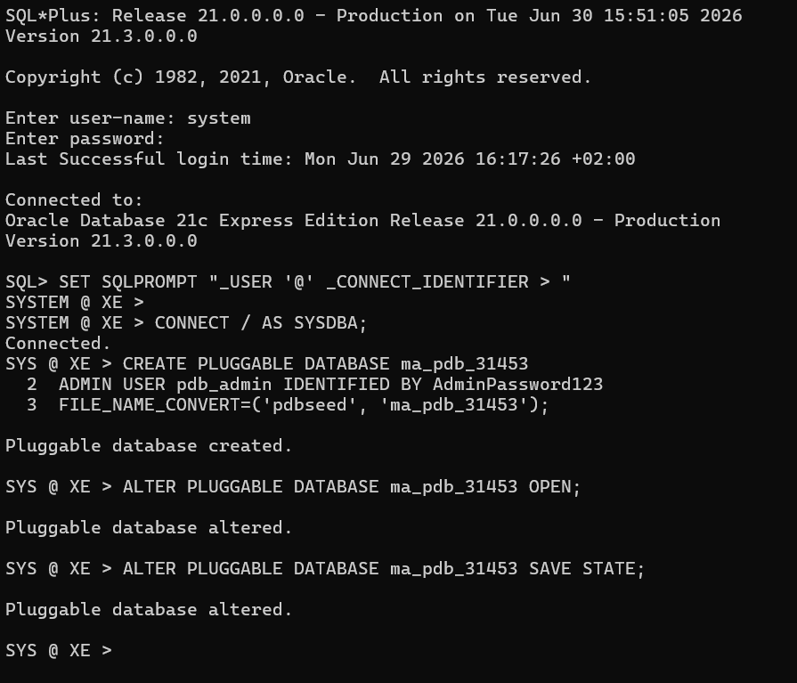
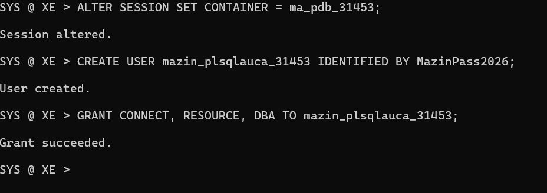
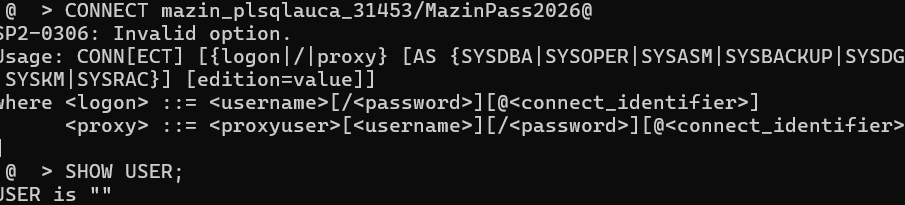
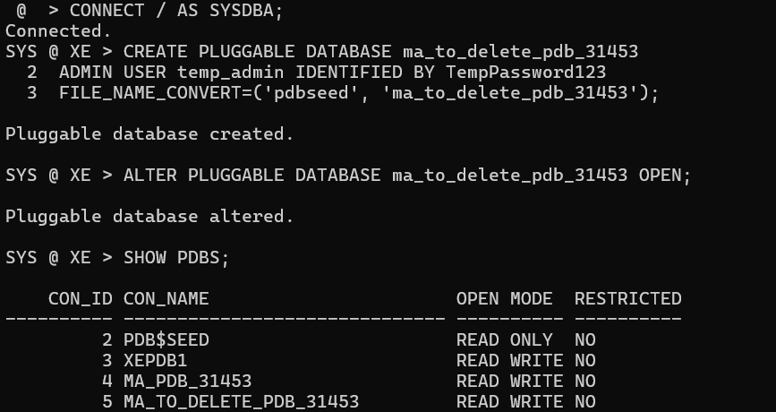
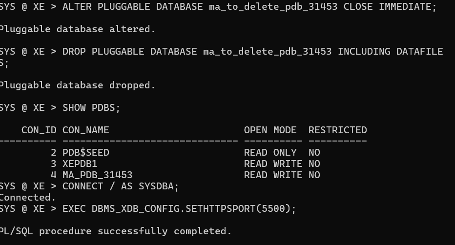
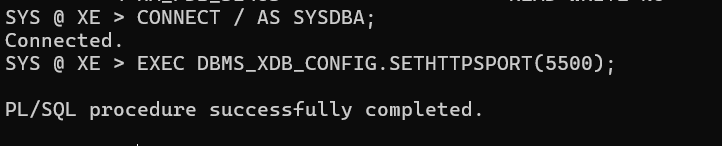

# Assignment II: Oracle Pluggable Database (PDB) Administration

## 1. Assignment Overview
This practical assignment demonstrates the hands-on implementation, administration, and management of Pluggable Databases (PDBs) within the Oracle Multitenant Architecture.

---

## 2. Oracle Environment
*   **Oracle Version Used:** Oracle Database 21c Express Edition (XE)
*   **Operating System/Environment:** Windows 11 / Command Prompt (SQL*Plus)
*   **Tools Used:** SQL*Plus, Oracle Enterprise Manager (OEM) Express

---

## 3. Task Documentation

### Task 1: Create and Configure a New Pluggable Database (PDB)
*   **PDB Creation & Status Verification:**
    ```sql
    CREATE PLUGGABLE DATABASE ma_pdb_31453
    ADMIN USER pdb_admin IDENTIFIED BY AdminPass123;
    ALTER PLUGGABLE DATABASE ma_pdb_31453 OPEN;
    ALTER PLUGGABLE DATABASE ma_pdb_31453 SAVE STATE;
    ```
    

*   **User Creation & Privilege Assignment:**
    ```sql
    ALTER SESSION SET CONTAINER = ma_pdb_31453;
    CREATE USER mazin_plsqlauca_31453 IDENTIFIED BY UserPass123;
    GRANT CONNECT, RESOURCE, DBA TO mazin_plsqlauca_31453;
    ```
    
    

---

### Task 2: Create and Delete a Temporary PDB
*   **Temporary PDB Lifecycle Workflow:**
    ```sql
    ALTER PLUGGABLE DATABASE ma_to_delete_pdb_31453 CLOSE IMMEDIATE;
    DROP PLUGGABLE DATABASE ma_to_delete_pdb_31453 INCLUDING DATAFILES;
    ```
    
    

---

### Task 3: Oracle Enterprise Manager (OEM)
*   **Environment Overview & Performance Metrics Monitoring:**
    

---

## 4. Challenges and Solutions
*   **Challenge:** Encountered `ORA-65096: invalid common user or role name` when attempting local account provisioning.
    *   *Solution:* Corrected the local container context scope using the explicit session container switch command `ALTER SESSION SET CONTAINER`.

---

## 5. Lessons Learned
*   Mastered autonomous container state lifecycle orchestration procedures inside container architectures.

---

## 6. Integrity Statement
"I confirm that this assignment represents my own practical work, screenshots, and documentation. All external resources consulted have been properly acknowledged."
